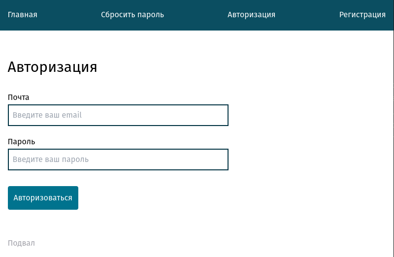

# HTML веб-сервер

Реализация веб-сервера для генерации HTML страниц.

Разобрал новые темы и создал некоторую отправную точку для последующих проектов.



## Запуск проекта

```bash
modd
```

## Миграция

```
goose -dir ./internal/database/migrations create password_reset sql
goose -dir ./internal/database/migrations sqlite3 ./internal/database/sqlite.db create init sql
goose -dir ./internal/database/migrations sqlite3 ./internal/database/sqlite.db status
goose -dir ./internal/database/migrations sqlite3 ./internal/database/sqlite.db up
goose -dir ./internal/database/migrations sqlite3 ./internal/database/sqlite.db down
goose -dir ./internal/database/migrations sqlite3 ./internal/database/sqlite.db reset
```

## Фичи

- Конфигурационный файл (переменные среды)
- Логирование (slog)
- Роутер (context)
- Middleware (context)
- Шаблоны (layout, page, parts)
- Статические файлы (assets)
- CSRF
- Подключение к БД (sqlite, postgres)
- Миграция
- Tailwind
- Livereload
- Отправка почты
- Создания токена
- Создание куки
- Рефакторинг (middleware конфиг, подключение к БД, логгер, csrf)
- Ошибки
- Controller
- Регистрация
- Валидация данных
- Сессия
- Авторизация
- Выход из системы
- Шаблонизатор авторизованного пользователя-
- Сброс пароля
